# Host My CV on AWS (S3 + CloudFront + ACM + GoDaddy)

> **Project Type:** Personal Cloud Project (Static Content Hosting)  
> **Platform:** AWS + GoDaddy DNS  
> **Outcome:** Hosted my CV on a secure HTTPS endpoint using CloudFront in front of a private S3 bucket.

---

## 1) Project Summary

I hosted my CV on AWS using a production-style approach:

- **S3 bucket kept private** (no public access)
- **CloudFront** serves the content globally
- **ACM certificate** provides HTTPS
- **GoDaddy DNS** maps `cv.xdctest.xyz` to CloudFront

This setup demonstrates practical skills in static hosting, TLS/HTTPS, DNS, and access control.

---

## 2) Architecture

**Browser → CloudFront (HTTPS) → S3 (Private Bucket)**

- CloudFront handles TLS termination and caching.
- S3 stores the files (HTML + PDF).
- Access to S3 is restricted to CloudFront using **Origin Access Control (OAC)**.

---

## 3) Files Hosted

- `index.html` (landing page)
- `Ifeanyi-Okoye-CV.pdf` (resume/CV)

Optional:
- `Ifeanyi-Okoye-Cover-Letter.pdf`

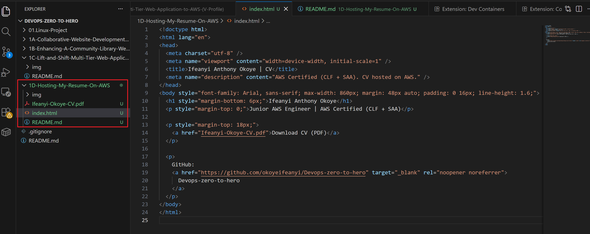

---

## 4) Implementation Steps

### Step 1: Create the S3 bucket (private)

- Logged into AWS Console
- Created an S3 bucket: `cv.xdctest.xyz`
- Region: `ap-southeast-2` (Sydney)
- Left **Block all public access = ON**

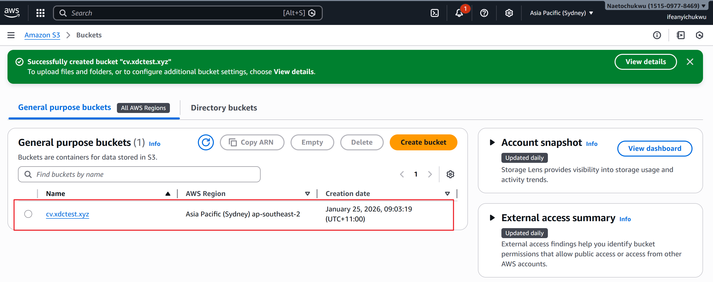

---

### Step 2: Upload files to S3

Uploaded:
- `index.html`
- `Ifeanyi-Okoye-CV.pdf`
- (optional) cover letter PDF

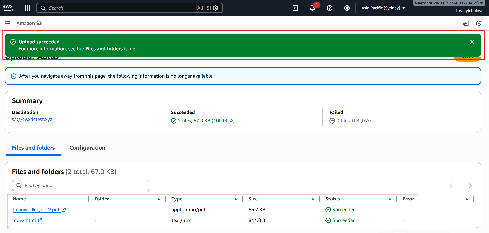

---

### Step 3: Request SSL certificate in ACM (us-east-1)

- Opened **AWS Certificate Manager (ACM)**
- Switched region to **us-east-1 (N. Virginia)**
- Requested a **Public certificate**
- Domain: `cv.xdctest.xyz`
- DNS validation selected

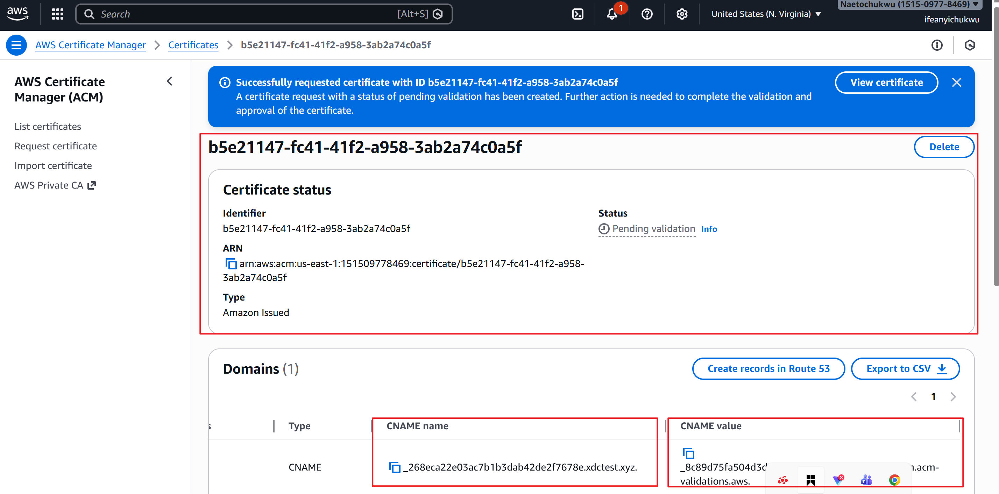

---

### Step 4: Add ACM validation record in GoDaddy

- Went to GoDaddy DNS settings for `xdctest.xyz`
- Added the **CNAME** record provided by ACM:
  - Host/Name: ACM value (e.g. `_abc123...`)
  - Points to: ACM value (e.g. `_xyz.acm-validations.aws...`)

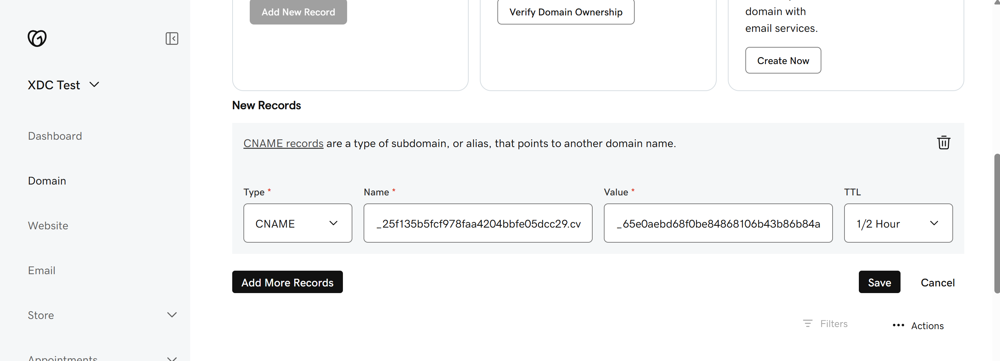

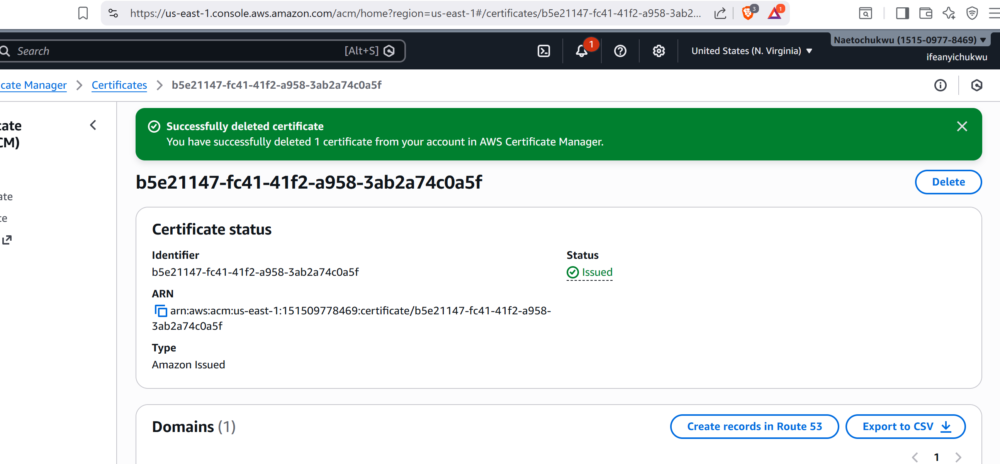

---

### Step 5: Create CloudFront distribution

- Created a CloudFront distribution
- Origin: selected S3 bucket `cv.xdctest.xyz`
- Enabled **Origin Access Control (OAC)**
- Viewer protocol policy: **Redirect HTTP to HTTPS**
- Allowed methods: **GET, HEAD**
- Custom domain (CNAME): `cv.xdctest.xyz`
- SSL certificate: selected ACM cert (from us-east-1)
- Default root object: `index.html`

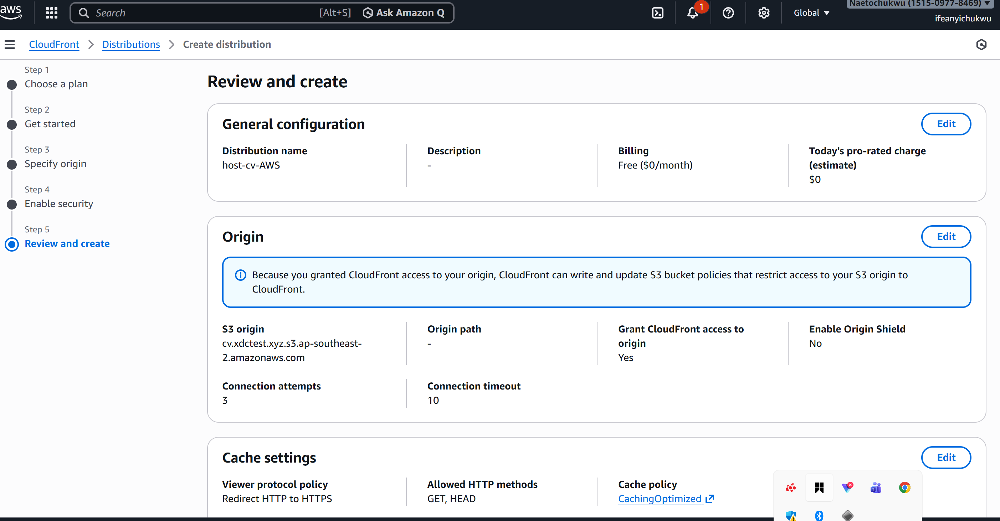

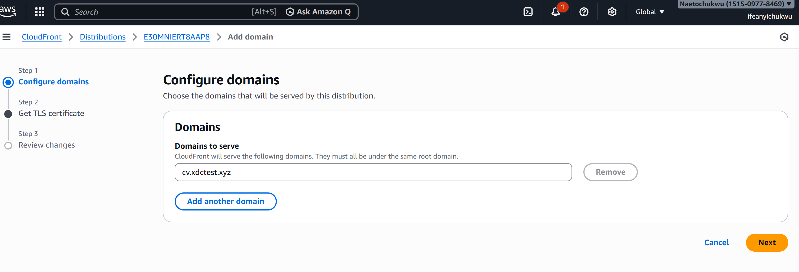

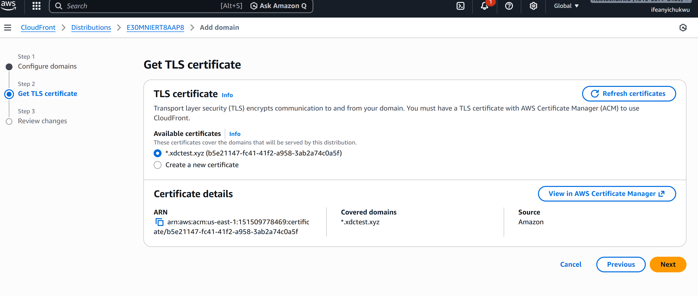

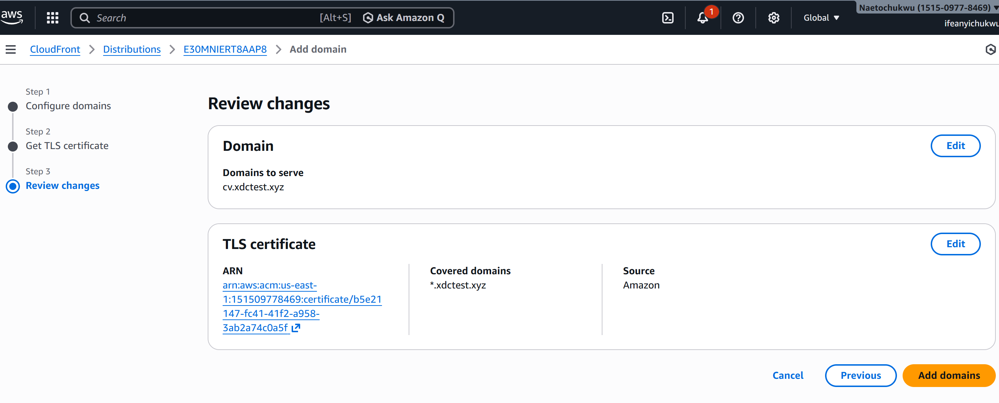

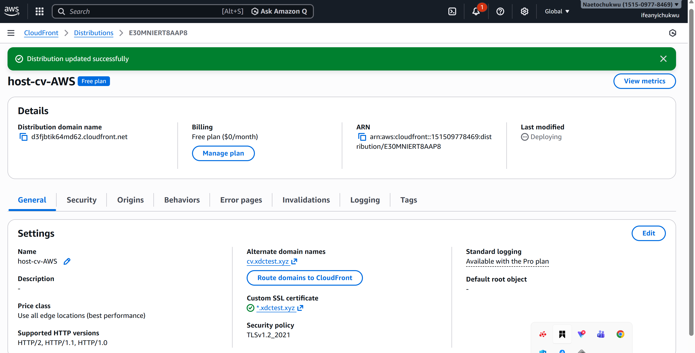

---

### Step 6: Allow CloudFront to read the private S3 bucket (OAC policy)

- Used CloudFront prompt to update bucket policy, or manually updated S3 bucket policy
- Ensured CloudFront can read objects (`s3:GetObject`) from the bucket via OAC

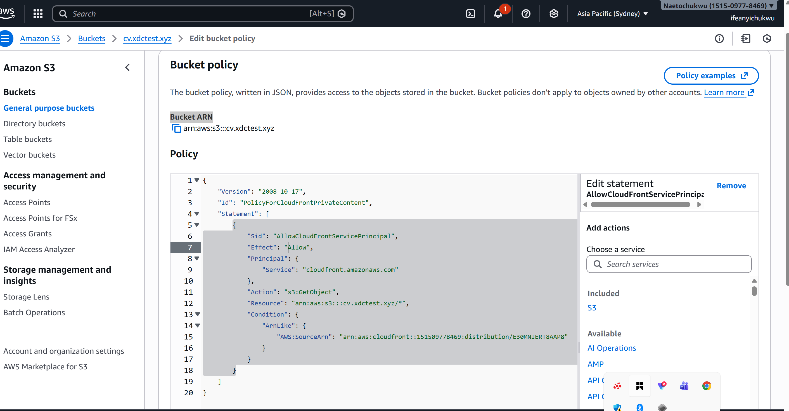

---

### Step 7: Point GoDaddy subdomain `cv` to CloudFront

In GoDaddy DNS:
- Created a CNAME record:
  - Host: `cv`
  - Points to: `dxxxx.cloudfront.net`

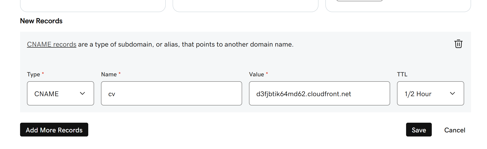

---

### Step 8: Test the site

- Opened `https://cv.xdctest.xyz`
- Verify `index.html` loads
- Clicked “Download CV” and confirmed the PDF opens/downloads

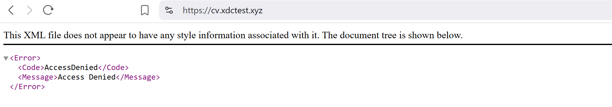

- `https://cv.xdctest.xyz` failed to open with the error message above. see my fix below.

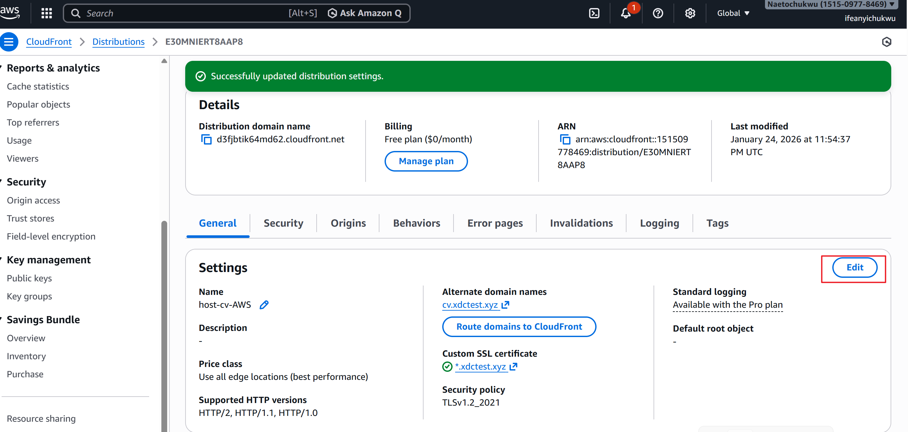

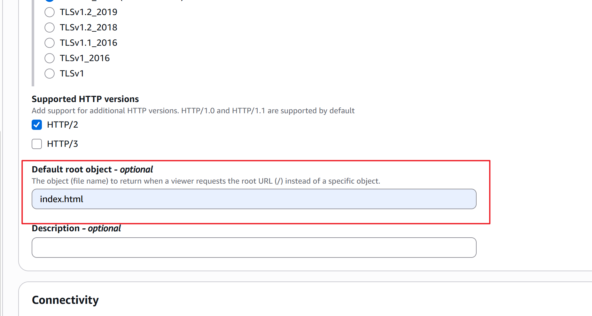

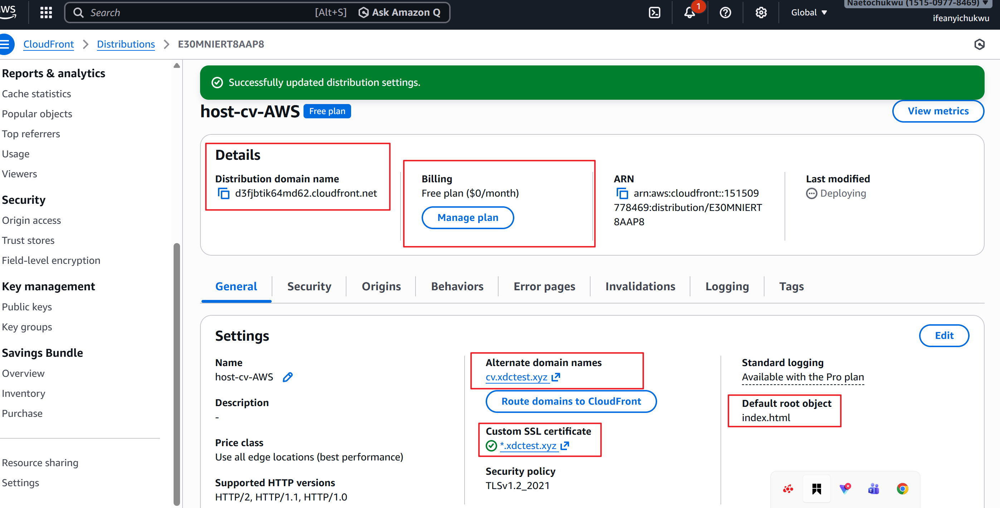

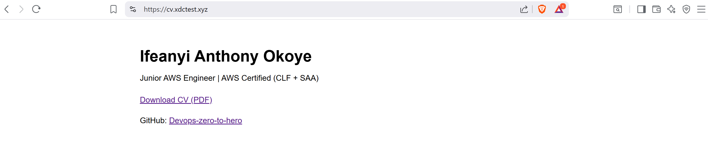

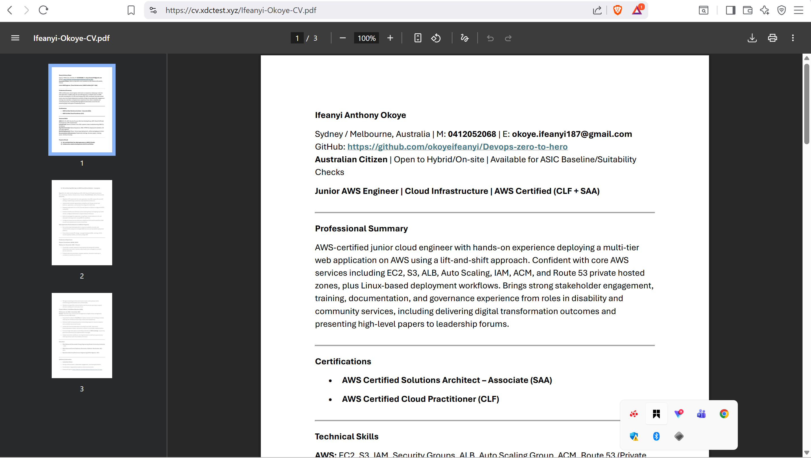

Common issues checked:
- ACM certificate still pending
- CloudFront distribution still deploying
- Incorrect DNS CNAME
- Missing OAC / bucket policy permissions
- Default root object not added

---

## 5) Results

- CV hosted on a custom domain with HTTPS:
  - `https://cv.xdctest.xyz`
- S3 bucket remains private
- CloudFront securely serves content
- DNS configured via GoDaddy

---

## 6) Lessons Learned

- CloudFront + private S3 is cleaner than public S3 website hosting.
- DNS validation is often the slowest step, and small typos can block issuance.
- OAC + correct bucket policy is critical to avoid `AccessDenied`.
- Default root object not added could also result to 'access denied'

---

## 7) Future Improvements

- Add a `/projects` page showcasing AWS projects with screenshots and READMEs
- Enable CloudFront access logs (only if needed)
- Add security headers via CloudFront response headers policy
- Automate deployment using GitHub Actions (sync to S3 + invalidate CloudFront)
